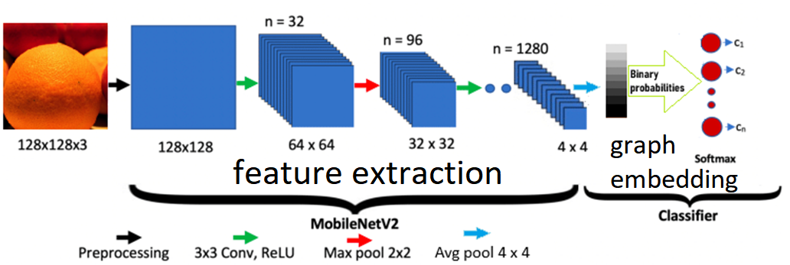
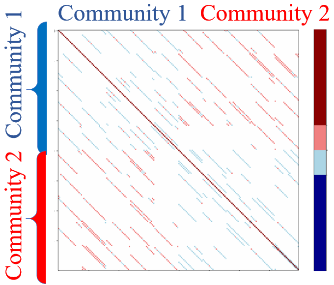
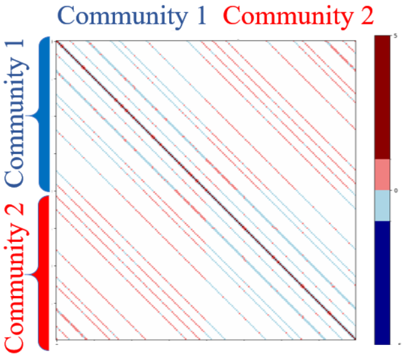
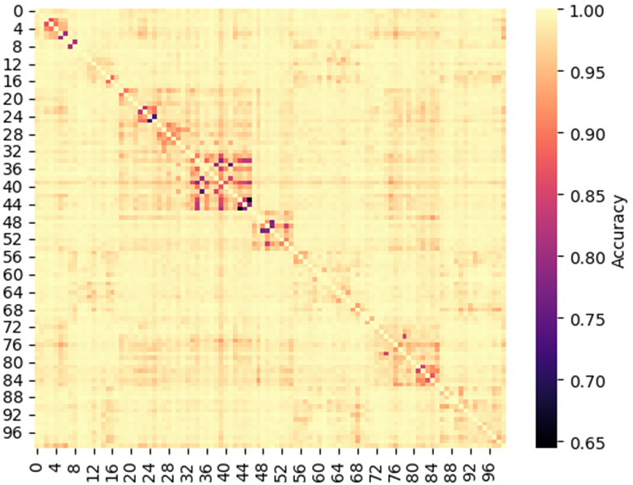
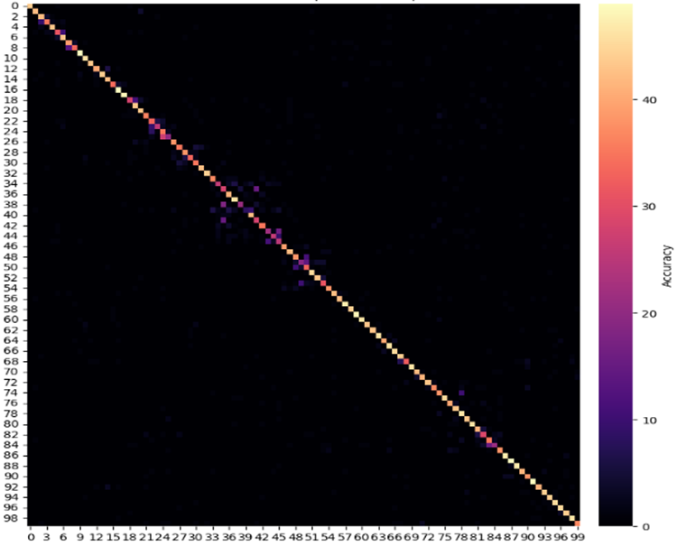

# Improving CNN Feature Usage in Final MLP Layers Through Nishimori Clustering and Classification, Leveraging Upper Bounds on Trapping Sets (Codewords & Pseudocodewords) Derived from MacKay-Davey-Vontobel-Smarandache-Butler-Siegel Theory, and Incorporating Topology-Aware Optimized RBIM Trapping Sets

[

Clustering of features under Torical graph 

[

**Table 1:** Trapping-set spectrum (each entry shows $(a,b)$ and the number of trapping sets multiple 520) of torical Multi-Edge LDPC $\mathcal G_{\rm tor}^{\star}$.

| $TS(a,b)$ [count] | $TS(a,b)$ [count] | $TS(a,b)$ [count] | $TS(a,b)$ [count] |
|:------------------:|:------------------:|:------------------:|:------------------:|
| (29, 28) [5] | (27, 24) [4] | (25, 22) [3] | (23, 18) [3] |
| (29, 26) [4] | (27, 22) [2] | (25, 20) [6] | (22, 22) [11] |
| (29, 24) [2] | (27, 18) [2] | (24, 24) [4] | (22, 20) [2] |
| (29, 20) [1] | (26, 26) [6] | (24, 22) [3] | (21, 20) [6] |
| (29, 16) [2] | (26, 24) [3] | (24, 20) [1] | (21, 18) [1] |
| (28, 28) [9] | (26, 22) [2] | (23, 22) [2] | (20, 20) [2] |
| (28, 26) [5] | (26, 20) [1] | (23, 20) [3] | (20, 18) [1] |
| (28, 24) [3] | (26, 18) [2] | (19, 18) [6] | (18, 18) [1] |
| (28, 20) [2] | (25, 24) [4] | — | — |
| (28, 18) [1] | (27, 26) [1] | — | — |

**Table 2:** Trapping-set spectrum (each entry shows $(a,b)$ and the number of trapping sets multiple 520) of torical Multi-Edge LDPC $\mathcal G_{\rm tor}^{-}$.

| $(a,b)$ [count] | $(a,b)$ [count] | $(a,b)$ [count] | $(a,b)$ [count] |
|:---------------:|:---------------:|:---------------:|:---------------:|
| (24, 8) [1] | (16, 12) [2] | (13, 10) [4] | (10, 8) [2] |
| (21, 12) [1] | (16, 10) [2] | (13, 8) [2] | (10, 6) [4] |
| (21, 10) [1] | (16, 8) [3] | (13, 6) [1] | (10, 4) [5] |
| (19, 12) [1] | (15, 12) [3] | (13, 4) [1] | (10, 2) [1] |
| (19, 10) [2] | (15, 10) [2] | (12, 10) [1] | (9, 6) [9] |
| (18, 14) [1] | (15, 8) [2] | (12, 8) [1] | (9, 4) [1] |
| (18, 12) [2] | (15, 6) [1] | (12, 6) [3] | (8, 6) [10] |
| (18, 10) [2] | (15, 2) [1] | (11, 8) [6] | (8, 4) [6] |
| (18, 8) [2] | (14, 10) [2] | (11, 6) [7] | (7, 4) [6] |
| (18, 6) [1] | (14, 8) [2] | (11, 4) [3] | (7, 2) [2] |
| (17, 12) [3] | (14, 6) [3] | — | (6, 4) [2] |
| (17, 10) [1] | (13, 12) [1] | — | (6, 2) [2] |
| (17, 8) [2] | — | — | (4, 2) [2] |
| (17, 6) [1] | — | — | — |
| (16, 14) [1] | — | — | — |

Clustering of features  under Spherical  graph 

[

**Table 3:** Trapping-set spectrum of the spherical $S^{0}$ graph (each entry repeated in $2\,600$ cyclic translates).

| $(a,b)$ | $(a,b)$ | $(a,b)$ | $(a,b)$ |
|:-------:|:-------:|:-------:|:-------:|
| (4, 48) | (12, 48) | (20, 60) | (28, 46) |
| (5, 55) | (13, 39) | (21, 65) | (29, 35) |
| (6, 60) | (14, 28) | (22, 68) | (30, 26) |
| (7, 63) | (15, 15) | (23, 69) | — |
| (8, 64) | (16, 26) | (24, 68) | — |
| (9, 63) | (17, 35) | (25, 65) | — |
| (10, 60) | (18, 46) | (26, 60) | — |
| (11, 55) | (19, 53) | (27, 53) | — |

**Table 4:** Trapping-set spectrum of the spherical $S^{1}$ graph (each entry repeated in $2\,600$ cyclic translates).

| $TS(a,b)$ | $TS(a,b)$ | $TS(a,b)$ | $TS(a,b)$ |
|:---------:|:---------:|:---------:|:---------:|
| (4, 44) | (12, 42) | (20, 56) | (28, 44) |
| (5, 49) | (13, 33) | (21, 59) | (29, 35) |
| (6, 54) | (14, 24) | (22, 58) | (30, 28) |
| (7, 57) | (15, 15) | (23, 49) | — |
| (8, 58) | (16, 26) | (24, 44) | — |
| (9, 57) | (17, 35) | (25, 39) | — |
| (10, 54) | (18, 44) | (26, 26) | — |
| (11, 49) | (19, 51) | (27, 35) | — |

**Table 5:** ImageNet-100 classification accuracy (%) and spectral‑embedding training time under TS optimized and non-optimized Graph embedding.

<table>
  <thead>
    <tr>
      <th rowspan="2">Graph</th>
      <th colspan="2">Centroid</th>
      <th colspan="2">Bayesian</th>
      <th rowspan="2">Train time (sec)</th>
    </tr>
    <tr>
      <th>Top‑1</th>
      <th>Top‑3</th>
      <th>Top‑1</th>
      <th>Top‑3</th>
    </tr>
  </thead>
  <tbody>
    <tr>
      <td>$\mathcal G_{\rm tor}^{-}$</td>
      <td>5.90</td>
      <td>16.54</td>
      <td>13.68</td>
      <td>24.50</td>
      <td>739.95</td>
    </tr>
    <tr>
      <td>$\mathcal G_{\rm tor}^{\star}$</td>
      <td>59.66</td>
      <td>83.06</td>
      <td>67.24</td>
      <td>85.82</td>
      <td>336.66</td>
    </tr>
    <tr>
      <td>$S^{-}$</td>
      <td>63.20</td>
      <td>85.44</td>
      <td>68.94</td>
      <td>87.16</td>
      <td>281.17</td>
    </tr>
    <tr>
      <td>$S^{+}$</td>
      <td><strong>67.26</strong></td>
      <td><strong>87.52</strong></td>
      <td>28.50</td>
      <td>65.46</td>
      <td>291.58</td>
    </tr>
  </tbody>
</table>

## Spectral–Topological Correspondence

When a trapping set is embedded into an RBIM operated at the Nishimori temperature, its combinatorial structure translates directly into spectral and topological invariants of the feature manifold. This section makes that correspondence precise.

### The restricted Bethe–Hessian as a signed Laplacian

Let $\mathcal T\subseteq\zeta$ be a trapping‑set subgraph induced by variable‑node set $S$, with local adjacency $A_{\mathcal T}$ and degree sequence $\deg_{\mathcal T}$. Restricting the Bethe–Hessian (see the full expression elsewhere) to $\mathcal T$ yields

$$
H_{\beta,J}^{\mathcal T}=D^{\mathcal T}(\beta)-B^{\mathcal T}(\beta),
$$

where, for $i\neq j$ with $(i,j)\in E(\mathcal T)$,

$$
\begin{aligned}
B_{ij}^{\mathcal T}(\beta)&=\frac{\tanh(\beta J_{ij})}{1-\tanh^{2}(\beta J_{ij})}, && i\neq j,\\
D_{ii}^{\mathcal T}(\beta)&=1+\sum_{j:\,(i,j)\in E_{\mathcal T}}
   \frac{\tanh^{2}(\beta J_{ij})}{1-\tanh^{2}(\beta J_{ij})}.
\end{aligned}
$$

Thus $H_{\beta,J}^{\mathcal T}$ is the weighted signed Laplacian of $\mathcal T$.

### Critical modes and Betti numbers

The first Betti number (cycle rank) of $\mathcal T$ is

$$
\beta_1(\mathcal T)=|E(\mathcal T)|-|V(\mathcal T)|+c(\mathcal T).
$$

**Theorem 1 (Spectrum of trapping sets).**  
Let $\mathcal T$ be a trapping‑set subgraph and let $H_{\beta_N,J}^{\mathcal T}$ be its restricted Bethe–Hessian at the Nishimori temperature. In the strong‑coupling limit ($|\tanh(\beta_N J_{ij})|\to1$ on cycle edges), the number of non‑positive eigenvalue modes equals $\beta_1(\mathcal T)$:

$$
q_{\mathcal T}=\lambda\{\lambda\le0\text{ of }H_{\beta_N,J}^{\mathcal T}\}=\beta_1(\mathcal T).
$$

Each independent cycle contributes exactly one critical eigenvalue crossing through zero at $\beta=\beta_N$; for $\beta>\beta_N$ these modes become negative.

**Corollary 1 (Ihara–Bass correspondence).**  
Every zero of $\det H_{\beta_N,J}$ produced by a trapping set corresponds to a pole of the Ihara–Bass zeta function

$$
\zeta_{\mathcal G}(u)=\prod_{[C]}\bigl(1-u^{\ell(C)}\bigr)^{-1},
$$

where $[C]$ runs over primitive cycles. Removing trapping sets eliminates the associated poles and restores a clean spectral gap.

### Topological invariants of common trapping sets

Table 6 (presented earlier) collects the geometric and topological signatures of six frequently occurring structures. The continuous genus

$$
\widehat A(\mathcal T)=\frac{1}{2\sqrt{n_V}}\Biggl(
    \sum_{\lambda_i\in\Lambda^+}\!\sqrt{\lambda_i}
    -\sum_{\lambda_j\in\Lambda^-}\!\sqrt{-\lambda_j}
\Biggr)
$$

measures how “twisted” the subgraph is; larger values correlate with more severe degradation of downstream classification performance. Example of TS(4, 2), TS(4, 6), TS(9, 2) …

## Discussion of results

The table reveals striking correlations between trapping-set structure and classifier behaviour.

**$G_{\rm tor}^{-}$ (toroidal 0).** With abundant small trapping sets down to $\TS{8}{6}$ (see the toroidal bad trapping‑set table), the embedding landscape is riddled with spurious basins. Both classifiers collapse—top‑1 accuracy stays below $14\%$—because the spectral mass leaks into pseudocodeword modes rather than concentrating on the true $100$ class centroids. Training time is also highest ($\sim 740$ s) because the eigensolver requires many Arnoldi iterations to resolve a fragmented spectrum.

**$G_{\rm tor}^{\star}$ (toroidal 1).** Eliminating all trapping sets with $a<20$ removes the dominant low‑energy defects. Accuracy jumps to $67.24\%$ top‑1 with Bayesian smoothing, confirming that when small TS are absent the spectral embedding captures meaningful semantic structure. The reduced training time ($337$ s) reflects a cleaner spectrum.

**$S^{-}$ (spherical 0).** This single‑ring code offers strong uniform performance across both classifiers ($68.94\%$ top‑1 Bayesian), indicating that its trapping‑set distribution—while dense in small $a$—has large enough $b$ (hence high harm values) to avoid deep pseudocodeword basins.

**$S^{+}$ (spherical 1).** The most intriguing case: centroid clustering reaches the highest top‑1 score ($67.26\%$), yet Bayesian classification plummets to $28.5\%$. The explanation lies in the *morphology* of the spectral clusters. Because sph1 retains many low‑EMD trapping sets, its free‑energy landscape is multimodal: each true class is surrounded by shifted “ghost” replicas created by cyclic symmetries in the single‑ring graph. A geometric centroid rule is insensitive to these replicas (it simply finds the middle of the cloud), whereas a parametric Gaussian Bayes model tries to fit a unimodal distribution and is destroyed by the hidden mixture structure. This dichotomy underscores that trapping sets influence not only raw accuracy but also the *choice* of classifier head that can be safely deployed.

Ensembling spectral embeddings exploits the Top‑1 and Top‑3 accuracy tradeoffs between spherical and torical graphs. Using a hierarchical or voting framework (hard/soft), the ensemble first maximizes Top‑3 prediction accuracy, then selects the graph topology with the optimal Top‑1 performance.

**Table 6:** Topological and spectral invariants of trapping sets.

<table>
  <thead>
    <tr>
      <th>Invariant</th>
      <th>TS$(4,2)$</th>
      <th>TS$(4,6)$</th>
      <th>TS$(26,20)$</th>
      <th>TS$(9,2)$</th>
      <th>TS$(13,6)$</th>
      <th>TS$(28,22)$</th>
    </tr>
  </thead>
  <tbody>
    <tr>
      <td>$\rho$ (spectral radius)</td>
      <td>$1.618$</td>
      <td>$4.000$</td>
      <td>$2.755$</td>
      <td>$8.917$</td>
      <td>$10.42$</td>
      <td>$13.56$</td>
    </tr>
    <tr>
      <td>$r_{\rm crit}=\sqrt\rho$</td>
      <td>$1.272$</td>
      <td>$2.000$</td>
      <td>$1.660$</td>
      <td>$2.986$</td>
      <td>$3.227$</td>
      <td>$3.683$</td>
    </tr>
    <tr>
      <td>$\#\{\lambda(H_1)<0\}$</td>
      <td>$1$</td>
      <td>$2$</td>
      <td>$1$</td>
      <td>$1$</td>
      <td>$0$</td>
      <td>$0$</td>
    </tr>
    <tr>
      <td>$\widehat A$ (continuous genus)</td>
      <td>$1.007$</td>
      <td>$1.529$</td>
      <td>$3.590$</td>
      <td>$3.069$</td>
      <td>$4.031$</td>
      <td>$7.267$</td>
    </tr>
    <tr>
      <td>$K_0$ ($\beta_0$)</td>
      <td>$1$</td>
      <td>$5$</td>
      <td>$7$</td>
      <td>$12$</td>
      <td>$17$</td>
      <td>$45$</td>
    </tr>
    <tr>
      <td>$K_1$ ($\beta_1$)</td>
      <td>$1$</td>
      <td>$1$</td>
      <td>$1$</td>
      <td>$0$</td>
      <td>$1$</td>
      <td>$1$</td>
    </tr>
    <tr>
      <td>Kervaire $\kappa$</td>
      <td>$1$</td>
      <td>$1$</td>
      <td>$1$</td>
      <td>$0$</td>
      <td>$0$</td>
      <td>$0$</td>
    </tr>
    <tr>
      <td>$w_2$ (Stiefel–Whitney)</td>
      <td>$1$</td>
      <td>$1$</td>
      <td>$1$</td>
      <td>$1$</td>
      <td>$1$</td>
      <td>$1$</td>
    </tr>
    <tr>
      <td>Bordism obstruction</td>
      <td>$0$</td>
      <td>$0$</td>
      <td>$0$</td>
      <td>$0$</td>
      <td>$0$</td>
      <td>$1$</td>
    </tr>
  </tbody>
</table>

A non‑zero bordism obstruction between two classes $i$ and $j$ means the disjoint union of their feature manifolds $M_i\sqcup(-M_j)$ is not null‑bordant; no graph embedding can achieve perfect linear separation in that subspace. The presence of TS$(28,22)$—with bordism obstruction $1$ and genus $\widehat A=7.267$—therefore signals a fundamental topological barrier to classification unless the set is excised.

$$
\begin{align}
H_{\mathrm{TS}(4,2)} &= 
\begin{bmatrix}
1 & 0 & 0 & 0 \\
1 & 1 & 0 & 0 \\
0 & 1 & 1 & 0 \\
0 & 0 & 1 & 1 \\
0 & 0 & 0 & 1
\end{bmatrix},
&
H_{\mathrm{TS}(4,6)} &= 
\begin{bmatrix}
0 & 1 & 0 & 0 \\
1 & 0 & 0 & 0 \\
1 & 1 & 0 & 0 \\
0 & 1 & 0 & 0 \\
1 & 0 & 0 & 0 \\
1 & 1 & 0 & 0 \\
0 & 1 & 0 & 1 \\
1 & 0 & 1 & 0 \\
0 & 1 & 0 & 1 \\
1 & 0 & 1 & 0 \\
0 & 1 & 0 & 0 \\
1 & 0 & 0 & 0 \\
1 & 1 & 0 & 0
\end{bmatrix},
H_{\mathrm{TS}(9,2)} &= 
\begin{bmatrix}
1 & 1 & 1 & 1 & 0 & 0 & 0 & 0 & 0 \\
0 & 1 & 0 & 1 & 0 & 0 & 0 & 0 & 0 \\
1 & 0 & 1 & 0 & 0 & 0 & 0 & 0 & 0 \\
1 & 1 & 1 & 1 & 0 & 0 & 0 & 0 & 0 \\
0 & 1 & 0 & 1 & 0 & 0 & 0 & 0 & 0 \\
1 & 0 & 1 & 0 & 1 & 0 & 0 & 0 & 0 \\
1 & 0 & 0 & 0 & 0 & 0 & 1 & 0 & 0 \\
0 & 1 & 0 & 0 & 0 & 0 & 0 & 0 & 0 \\
0 & 0 & 0 & 0 & 1 & 1 & 0 & 0 & 0 \\
1 & 0 & 0 & 0 & 0 & 0 & 1 & 0 & 0 \\
0 & 1 & 0 & 0 & 0 & 0 & 0 & 0 & 1 \\
0 & 0 & 0 & 0 & 0 & 1 & 0 & 1 & 0 \\
1 & 1 & 0 & 0 & 0 & 0 & 0 & 0 & 0 \\
0 & 1 & 0 & 0 & 0 & 0 & 0 & 0 & 1 \\
1 & 0 & 0 & 0 & 0 & 0 & 0 & 1 & 0
\end{bmatrix}.
\end{align}
$$

_TS(4,6)_TS(9,2).png)

$$
H_{\mathrm{TS}(4,44)} =
\begin{bmatrix}
1 & 1 & 0 & 0 \\
0 & 1 & 0 & 0 \\
0 & 0 & 1 & 0 \\
0 & 0 & 0 & 1 \\
1 & 0 & 0 & 0 \\
0 & 1 & 0 & 0 \\
0 & 0 & 1 & 0 \\
0 & 0 & 0 & 1 \\
0 & 0 & 1 & 0 \\
1 & 0 & 0 & 0 \\
0 & 1 & 0 & 0 \\
0 & 0 & 0 & 1 \\
1 & 0 & 0 & 0 \\
0 & 1 & 0 & 0 \\
0 & 0 & 1 & 0 \\
0 & 0 & 1 & 0 \\
0 & 0 & 0 & 1 \\
0 & 0 & 1 & 0 \\
0 & 0 & 1 & 0 \\
0 & 0 & 0 & 1 \\
0 & 0 & 1 & 0 \\
0 & 0 & 1 & 1 \\
0 & 0 & 0 & 1 \\
1 & 0 & 0 & 0 \\
0 & 1 & 0 & 0 \\
0 & 0 & 0 & 1 \\
0 & 0 & 1 & 1 \\
0 & 0 & 1 & 0 \\
1 & 0 & 0 & 0 \\
0 & 1 & 0 & 0 \\
0 & 0 & 1 & 0 \\
1 & 0 & 1 & 0 \\
0 & 1 & 1 & 0 \\
0 & 0 & 1 & 0 \\
0 & 0 & 0 & 1 \\
1 & 0 & 0 & 0 \\
0 & 1 & 0 & 0 \\
0 & 0 & 0 & 1 \\
1 & 0 & 0 & 0 \\
0 & 1 & 0 & 0 \\
0 & 0 & 0 & 1 \\
1 & 0 & 0 & 1 \\
0 & 1 & 0 & 1 \\
0 & 0 & 0 & 1 \\
1 & 0 & 0 & 0 \\
0 & 1 & 0 & 0 \\
1 & 0 & 0 & 0 \\
0 & 1 & 0 & 0 \\
1 & 0 & 0 & 0 \\
0 & 1 & 0 & 0 \\
1 & 0 & 0 & 0 \\
1 & 1 & 0 & 0
\end{bmatrix}
$$

.png)

$$
H_{\mathrm{TS}(4,48)} =
\begin{bmatrix}
0 & 1 & 0 & 0 \\
0 & 0 & 1 & 0 \\
1 & 0 & 0 & 0 \\
0 & 1 & 0 & 0 \\
0 & 0 & 1 & 0 \\
1 & 0 & 0 & 0 \\
0 & 1 & 0 & 0 \\
0 & 0 & 0 & 1 \\
0 & 0 & 0 & 1 \\
0 & 0 & 1 & 0 \\
0 & 0 & 0 & 1 \\
0 & 0 & 1 & 0 \\
1 & 0 & 0 & 0 \\
0 & 1 & 0 & 0 \\
1 & 0 & 0 & 0 \\
0 & 1 & 0 & 0 \\
0 & 0 & 1 & 0 \\
0 & 0 & 0 & 1 \\
0 & 0 & 0 & 1 \\
0 & 0 & 1 & 0 \\
0 & 0 & 0 & 1 \\
0 & 0 & 1 & 0 \\
1 & 0 & 0 & 0 \\
0 & 1 & 0 & 0 \\
0 & 0 & 1 & 1 \\
1 & 0 & 0 & 0 \\
0 & 1 & 0 & 0 \\
0 & 0 & 1 & 0 \\
1 & 0 & 0 & 0 \\
0 & 1 & 0 & 0 \\
0 & 0 & 0 & 1 \\
0 & 0 & 0 & 1 \\
0 & 0 & 1 & 0 \\
1 & 0 & 0 & 0 \\
0 & 1 & 0 & 0 \\
0 & 0 & 0 & 1 \\
0 & 0 & 1 & 0 \\
1 & 0 & 1 & 0 \\
0 & 1 & 1 & 0 \\
0 & 0 & 0 & 1 \\
1 & 0 & 0 & 1 \\
0 & 1 & 0 & 1 \\
1 & 0 & 0 & 0 \\
0 & 1 & 0 & 0 \\
0 & 0 & 1 & 0 \\
0 & 0 & 1 & 0 \\
1 & 0 & 0 & 0 \\
0 & 1 & 0 & 0 \\
0 & 0 & 0 & 1 \\
0 & 0 & 0 & 1 \\
1 & 0 & 0 & 0 \\
0 & 1 & 0 & 0 \\
1 & 0 & 0 & 0 \\
1 & 1 & 0 & 0
\end{bmatrix}
$$

.png)

$$
H_{\mathrm{TS}(6,54)} =
\begin{bmatrix}
1 & 1 & 0 & 0 & 0 & 0 \\
0 & 1 & 0 & 0 & 0 & 0 \\
0 & 0 & 1 & 0 & 0 & 0 \\
0 & 0 & 1 & 0 & 0 & 0 \\
0 & 0 & 1 & 0 & 0 & 0 \\
0 & 0 & 0 & 1 & 0 & 0 \\
0 & 0 & 0 & 0 & 1 & 0 \\
0 & 0 & 1 & 0 & 0 & 0 \\
0 & 0 & 1 & 0 & 0 & 0 \\
0 & 0 & 0 & 0 & 0 & 1 \\
1 & 0 & 0 & 0 & 0 & 0 \\
0 & 1 & 0 & 0 & 0 & 0 \\
0 & 0 & 1 & 1 & 0 & 0 \\
0 & 0 & 1 & 0 & 0 & 0 \\
0 & 0 & 1 & 0 & 0 & 0 \\
0 & 0 & 1 & 0 & 1 & 0 \\
0 & 0 & 1 & 0 & 0 & 0 \\
0 & 0 & 0 & 1 & 0 & 0 \\
0 & 0 & 1 & 0 & 0 & 0 \\
0 & 0 & 1 & 0 & 0 & 1 \\
1 & 0 & 1 & 0 & 0 & 0 \\
0 & 1 & 1 & 0 & 0 & 0 \\
0 & 0 & 1 & 0 & 0 & 0 \\
0 & 0 & 0 & 0 & 1 & 0 \\
0 & 0 & 0 & 0 & 0 & 1 \\
1 & 0 & 0 & 0 & 0 & 0 \\
0 & 1 & 0 & 0 & 0 & 0 \\
0 & 0 & 0 & 1 & 0 & 0 \\
0 & 0 & 0 & 1 & 0 & 0 \\
0 & 0 & 0 & 0 & 1 & 0 \\
0 & 0 & 0 & 1 & 0 & 0 \\
0 & 0 & 0 & 1 & 0 & 0 \\
0 & 0 & 0 & 0 & 1 & 0 \\
0 & 0 & 0 & 1 & 0 & 0 \\
0 & 0 & 0 & 1 & 1 & 0 \\
0 & 0 & 0 & 0 & 1 & 0 \\
0 & 0 & 0 & 0 & 0 & 1 \\
1 & 0 & 0 & 0 & 0 & 0 \\
0 & 1 & 0 & 0 & 0 & 0 \\
0 & 0 & 0 & 0 & 1 & 0 \\
0 & 0 & 0 & 1 & 1 & 0 \\
0 & 0 & 0 & 1 & 0 & 0 \\
0 & 0 & 0 & 0 & 0 & 1 \\
1 & 0 & 0 & 0 & 0 & 0 \\
0 & 1 & 0 & 0 & 0 & 0 \\
0 & 0 & 0 & 1 & 0 & 1 \\
1 & 0 & 0 & 1 & 0 & 0 \\
0 & 1 & 0 & 1 & 0 & 0 \\
0 & 0 & 0 & 1 & 0 & 0 \\
0 & 0 & 0 & 0 & 1 & 0 \\
0 & 0 & 0 & 0 & 0 & 1 \\
1 & 0 & 0 & 0 & 0 & 0 \\
0 & 1 & 0 & 0 & 0 & 0 \\
0 & 0 & 0 & 0 & 1 & 0 \\
0 & 0 & 0 & 0 & 0 & 1 \\
1 & 0 & 0 & 0 & 0 & 0 \\
0 & 1 & 0 & 0 & 0 & 0 \\
0 & 0 & 0 & 0 & 1 & 1 \\
1 & 0 & 0 & 0 & 1 & 0 \\
0 & 1 & 0 & 0 & 1 & 0 \\
0 & 0 & 0 & 0 & 1 & 0 \\
0 & 0 & 0 & 0 & 0 & 1 \\
1 & 0 & 0 & 0 & 0 & 0 \\
0 & 1 & 0 & 0 & 0 & 0 \\
0 & 0 & 0 & 0 & 0 & 1 \\
1 & 0 & 0 & 0 & 0 & 0 \\
0 & 1 & 0 & 0 & 0 & 0 \\
0 & 0 & 0 & 0 & 0 & 1 \\
1 & 0 & 0 & 0 & 0 & 1 \\
0 & 1 & 0 & 0 & 0 & 1 \\
1 & 0 & 0 & 0 & 0 & 1 \\
1 & 1 & 0 & 0 & 0 & 0
\end{bmatrix}
$$

.png)

$$
H_{\mathrm{TS}(6,60)} =
\begin{bmatrix}
0 & 1 & 0 & 0 & 0 & 0 \\
0 & 0 & 1 & 0 & 0 & 0 \\
0 & 0 & 0 & 0 & 1 & 0 \\
1 & 0 & 0 & 0 & 0 & 0 \\
0 & 1 & 0 & 0 & 0 & 0 \\
0 & 0 & 1 & 0 & 1 & 0 \\
1 & 0 & 0 & 0 & 0 & 0 \\
0 & 1 & 0 & 0 & 0 & 0 \\
0 & 0 & 0 & 1 & 0 & 0 \\
0 & 0 & 0 & 0 & 0 & 1 \\
0 & 0 & 1 & 0 & 0 & 1 \\
0 & 0 & 0 & 1 & 0 & 0 \\
0 & 0 & 1 & 0 & 0 & 0 \\
0 & 0 & 0 & 1 & 0 & 0 \\
0 & 0 & 1 & 0 & 0 & 0 \\
0 & 0 & 0 & 0 & 1 & 0 \\
0 & 0 & 0 & 1 & 0 & 0 \\
0 & 0 & 0 & 0 & 0 & 1 \\
0 & 0 & 0 & 0 & 1 & 0 \\
1 & 0 & 0 & 0 & 0 & 0 \\
0 & 1 & 0 & 0 & 0 & 0 \\
0 & 0 & 1 & 0 & 0 & 0 \\
1 & 0 & 1 & 0 & 0 & 0 \\
0 & 1 & 1 & 0 & 0 & 0 \\
0 & 0 & 0 & 1 & 1 & 0 \\
0 & 0 & 0 & 0 & 0 & 1 \\
0 & 0 & 0 & 1 & 0 & 1 \\
0 & 0 & 0 & 1 & 0 & 0 \\
0 & 0 & 0 & 0 & 1 & 0 \\
0 & 0 & 1 & 0 & 0 & 0 \\
0 & 0 & 1 & 0 & 0 & 0 \\
0 & 0 & 0 & 0 & 0 & 1 \\
0 & 0 & 0 & 1 & 0 & 0 \\
0 & 0 & 0 & 0 & 1 & 0 \\
1 & 0 & 0 & 0 & 0 & 0 \\
0 & 1 & 0 & 0 & 0 & 0 \\
0 & 0 & 0 & 0 & 1 & 1 \\
1 & 0 & 0 & 0 & 0 & 0 \\
0 & 1 & 0 & 0 & 0 & 0 \\
0 & 0 & 0 & 0 & 1 & 0 \\
0 & 0 & 0 & 1 & 0 & 0 \\
1 & 0 & 0 & 1 & 0 & 0 \\
0 & 1 & 0 & 1 & 0 & 0 \\
0 & 0 & 0 & 0 & 0 & 1 \\
0 & 0 & 0 & 0 & 0 & 1 \\
0 & 0 & 0 & 0 & 1 & 0 \\
1 & 0 & 0 & 0 & 0 & 0 \\
0 & 1 & 0 & 0 & 0 & 0 \\
0 & 0 & 0 & 0 & 0 & 1 \\
0 & 0 & 1 & 0 & 0 & 0 \\
0 & 0 & 0 & 1 & 0 & 0 \\
0 & 0 & 1 & 0 & 0 & 0 \\
0 & 0 & 0 & 1 & 0 & 0 \\
0 & 0 & 0 & 0 & 1 & 0 \\
1 & 0 & 0 & 0 & 1 & 0 \\
0 & 1 & 0 & 0 & 1 & 0 \\
0 & 0 & 0 & 0 & 0 & 1 \\
1 & 0 & 0 & 0 & 0 & 1 \\
0 & 1 & 0 & 0 & 0 & 1 \\
1 & 0 & 0 & 0 & 0 & 0 \\
0 & 1 & 0 & 0 & 0 & 0 \\
0 & 0 & 0 & 0 & 1 & 0 \\
0 & 0 & 1 & 0 & 0 & 0 \\
0 & 0 & 0 & 0 & 1 & 0 \\
1 & 0 & 0 & 0 & 0 & 0 \\
0 & 1 & 0 & 0 & 0 & 0 \\
0 & 0 & 0 & 0 & 0 & 1 \\
0 & 0 & 0 & 0 & 0 & 1 \\
0 & 0 & 1 & 0 & 0 & 0 \\
0 & 0 & 0 & 1 & 0 & 0 \\
0 & 0 & 1 & 1 & 0 & 0 \\
1 & 0 & 0 & 0 & 0 & 0 \\
0 & 1 & 0 & 0 & 0 & 0 \\
1 & 0 & 0 & 0 & 0 & 0 \\
1 & 1 & 0 & 0 & 0 & 0
\end{bmatrix}
$$

.png)

$$
H_{\mathrm{TS}(8,58)} =
\begin{bmatrix}
1 & 1 & 0 & 0 & 0 & 0 & 0 & 0 \\
0 & 1 & 0 & 0 & 0 & 0 & 0 & 0 \\
0 & 0 & 1 & 0 & 0 & 0 & 0 & 0 \\
0 & 0 & 1 & 0 & 0 & 0 & 0 & 0 \\
0 & 0 & 1 & 0 & 0 & 0 & 0 & 0 \\
0 & 0 & 0 & 1 & 0 & 0 & 0 & 0 \\
0 & 0 & 0 & 0 & 1 & 0 & 0 & 0 \\
0 & 0 & 0 & 0 & 0 & 1 & 0 & 0 \\
0 & 0 & 0 & 0 & 0 & 0 & 1 & 0 \\
0 & 0 & 1 & 0 & 0 & 0 & 0 & 0 \\
0 & 0 & 1 & 1 & 0 & 0 & 0 & 0 \\
0 & 0 & 0 & 0 & 0 & 0 & 0 & 1 \\
1 & 0 & 0 & 0 & 0 & 0 & 0 & 0 \\
0 & 1 & 0 & 0 & 0 & 0 & 0 & 0 \\
0 & 0 & 1 & 0 & 1 & 0 & 0 & 0 \\
0 & 0 & 1 & 0 & 0 & 1 & 0 & 0 \\
0 & 0 & 1 & 0 & 0 & 0 & 0 & 0 \\
0 & 0 & 1 & 0 & 0 & 0 & 1 & 0 \\
0 & 0 & 0 & 1 & 0 & 0 & 0 & 0 \\
0 & 0 & 1 & 0 & 0 & 0 & 0 & 0 \\
0 & 0 & 0 & 0 & 1 & 0 & 0 & 0 \\
0 & 0 & 1 & 0 & 0 & 0 & 0 & 0 \\
0 & 0 & 0 & 0 & 0 & 1 & 0 & 0 \\
0 & 0 & 1 & 0 & 0 & 0 & 0 & 1 \\
1 & 0 & 1 & 0 & 0 & 0 & 0 & 0 \\
0 & 1 & 1 & 0 & 0 & 0 & 0 & 0 \\
0 & 0 & 1 & 0 & 0 & 0 & 0 & 0 \\
0 & 0 & 0 & 0 & 0 & 0 & 1 & 0 \\
0 & 0 & 0 & 0 & 0 & 0 & 0 & 1 \\
1 & 0 & 0 & 0 & 0 & 0 & 0 & 0 \\
0 & 1 & 0 & 0 & 0 & 0 & 0 & 0 \\
0 & 0 & 0 & 1 & 0 & 0 & 0 & 0 \\
0 & 0 & 0 & 0 & 1 & 0 & 0 & 0 \\
0 & 0 & 0 & 0 & 0 & 1 & 0 & 0 \\
0 & 0 & 0 & 1 & 0 & 0 & 0 & 0 \\
0 & 0 & 0 & 1 & 1 & 0 & 0 & 0 \\
0 & 0 & 0 & 0 & 0 & 0 & 1 & 0 \\
0 & 0 & 0 & 0 & 1 & 0 & 0 & 0 \\
0 & 0 & 0 & 1 & 0 & 1 & 0 & 0 \\
0 & 0 & 0 & 0 & 1 & 1 & 0 & 0 \\
0 & 0 & 0 & 1 & 0 & 0 & 0 & 0 \\
0 & 0 & 0 & 1 & 0 & 0 & 1 & 0 \\
0 & 0 & 0 & 0 & 1 & 0 & 0 & 0 \\
0 & 0 & 0 & 0 & 0 & 1 & 0 & 0 \\
0 & 0 & 0 & 0 & 1 & 0 & 1 & 0 \\
0 & 0 & 0 & 0 & 0 & 1 & 0 & 0 \\
0 & 0 & 0 & 0 & 0 & 1 & 1 & 0 \\
0 & 0 & 0 & 0 & 0 & 0 & 0 & 1 \\
1 & 0 & 0 & 0 & 0 & 0 & 0 & 0 \\
0 & 1 & 0 & 0 & 0 & 0 & 0 & 0 \\
0 & 0 & 0 & 1 & 0 & 0 & 0 & 0 \\
0 & 0 & 0 & 0 & 0 & 0 & 1 & 0 \\
0 & 0 & 0 & 1 & 0 & 0 & 0 & 0 \\
0 & 0 & 0 & 0 & 1 & 0 & 1 & 0 \\
0 & 0 & 0 & 0 & 1 & 0 & 0 & 0 \\
0 & 0 & 0 & 1 & 0 & 0 & 0 & 1 \\
1 & 0 & 0 & 1 & 0 & 0 & 0 & 0 \\
0 & 1 & 0 & 1 & 0 & 0 & 0 & 0 \\
0 & 0 & 0 & 1 & 0 & 0 & 0 & 0 \\
0 & 0 & 0 & 0 & 0 & 1 & 0 & 0 \\
0 & 0 & 0 & 0 & 1 & 0 & 0 & 1 \\
1 & 0 & 0 & 0 & 1 & 0 & 0 & 0 \\
0 & 1 & 0 & 0 & 1 & 0 & 0 & 0 \\
0 & 0 & 0 & 0 & 1 & 0 & 0 & 0 \\
0 & 0 & 0 & 0 & 0 & 1 & 0 & 0 \\
0 & 0 & 0 & 0 & 0 & 0 & 1 & 0 \\
0 & 0 & 0 & 0 & 0 & 1 & 0 & 1 \\
1 & 0 & 0 & 0 & 0 & 1 & 0 & 0 \\
0 & 1 & 0 & 0 & 0 & 1 & 0 & 0 \\
0 & 0 & 0 & 0 & 0 & 1 & 0 & 0 \\
0 & 0 & 0 & 0 & 0 & 0 & 1 & 0 \\
0 & 0 & 0 & 0 & 0 & 0 & 0 & 1 \\
1 & 0 & 0 & 0 & 0 & 0 & 0 & 0 \\
0 & 1 & 0 & 0 & 0 & 0 & 0 & 0 \\
0 & 0 & 0 & 0 & 0 & 0 & 1 & 1 \\
1 & 0 & 0 & 0 & 0 & 0 & 1 & 0 \\
0 & 1 & 0 & 0 & 0 & 0 & 1 & 0 \\
0 & 0 & 0 & 0 & 0 & 0 & 1 & 0 \\
0 & 0 & 0 & 0 & 0 & 0 & 0 & 1 \\
1 & 0 & 0 & 0 & 0 & 0 & 0 & 0 \\
0 & 1 & 0 & 0 & 0 & 0 & 0 & 0 \\
0 & 0 & 0 & 0 & 0 & 0 & 0 & 1 \\
1 & 0 & 0 & 0 & 0 & 0 & 0 & 0 \\
0 & 1 & 0 & 0 & 0 & 0 & 0 & 0 \\
0 & 0 & 0 & 0 & 0 & 0 & 0 & 1 \\
1 & 0 & 0 & 0 & 0 & 0 & 0 & 1 \\
0 & 1 & 0 & 0 & 0 & 0 & 0 & 1 \\
1 & 0 & 0 & 0 & 0 & 0 & 0 & 1 \\
1 & 1 & 0 & 0 & 0 & 0 & 0 & 0
\end{bmatrix}
$$

.png)

$$
H_{\mathrm{TS}(8,64)} =
\begin{bmatrix}
0 & 1 & 0 & 0 & 0 & 0 & 0 & 0 \\
0 & 0 & 1 & 0 & 0 & 0 & 0 & 0 \\
0 & 0 & 0 & 1 & 0 & 0 & 0 & 0 \\
0 & 0 & 0 & 0 & 1 & 0 & 0 & 0 \\
0 & 0 & 0 & 1 & 0 & 0 & 1 & 0 \\
1 & 0 & 0 & 0 & 0 & 0 & 0 & 0 \\
0 & 1 & 0 & 0 & 0 & 0 & 0 & 0 \\
0 & 0 & 0 & 0 & 1 & 0 & 1 & 0 \\
0 & 0 & 1 & 0 & 0 & 0 & 0 & 0 \\
1 & 0 & 1 & 0 & 0 & 0 & 0 & 0 \\
0 & 1 & 1 & 0 & 0 & 0 & 0 & 0 \\
0 & 0 & 0 & 0 & 0 & 1 & 0 & 0 \\
0 & 0 & 0 & 1 & 0 & 0 & 0 & 1 \\
0 & 0 & 0 & 0 & 1 & 0 & 0 & 1 \\
0 & 0 & 0 & 1 & 0 & 0 & 0 & 0 \\
0 & 0 & 0 & 0 & 0 & 1 & 0 & 0 \\
0 & 0 & 0 & 0 & 1 & 0 & 0 & 0 \\
0 & 0 & 0 & 0 & 0 & 1 & 0 & 0 \\
0 & 0 & 0 & 1 & 0 & 0 & 0 & 0 \\
0 & 0 & 1 & 0 & 0 & 0 & 0 & 0 \\
0 & 0 & 0 & 0 & 1 & 0 & 0 & 0 \\
0 & 0 & 1 & 0 & 0 & 0 & 0 & 0 \\
0 & 0 & 0 & 0 & 0 & 0 & 1 & 0 \\
0 & 0 & 0 & 0 & 0 & 1 & 0 & 0 \\
0 & 0 & 0 & 0 & 0 & 0 & 0 & 1 \\
0 & 0 & 0 & 0 & 0 & 0 & 1 & 0 \\
0 & 0 & 0 & 1 & 0 & 0 & 0 & 0 \\
1 & 0 & 0 & 1 & 0 & 0 & 0 & 0 \\
0 & 1 & 0 & 1 & 0 & 0 & 0 & 0 \\
0 & 0 & 0 & 0 & 1 & 0 & 0 & 0 \\
1 & 0 & 0 & 0 & 1 & 0 & 0 & 0 \\
0 & 1 & 0 & 0 & 1 & 0 & 0 & 0 \\
0 & 0 & 0 & 0 & 0 & 1 & 1 & 0 \\
0 & 0 & 0 & 0 & 0 & 0 & 0 & 1 \\
0 & 0 & 0 & 0 & 0 & 1 & 0 & 1 \\
0 & 0 & 0 & 0 & 0 & 1 & 0 & 0 \\
0 & 0 & 0 & 1 & 0 & 0 & 0 & 0 \\
0 & 0 & 0 & 0 & 0 & 0 & 1 & 0 \\
0 & 0 & 0 & 0 & 1 & 0 & 0 & 0 \\
0 & 0 & 1 & 1 & 0 & 0 & 0 & 0 \\
0 & 0 & 1 & 0 & 1 & 0 & 0 & 0 \\
0 & 0 & 0 & 0 & 0 & 0 & 0 & 1 \\
0 & 0 & 0 & 0 & 0 & 1 & 0 & 0 \\
0 & 0 & 0 & 0 & 0 & 0 & 1 & 0 \\
1 & 0 & 0 & 0 & 0 & 0 & 0 & 0 \\
0 & 1 & 0 & 0 & 0 & 0 & 0 & 0 \\
0 & 0 & 0 & 0 & 0 & 0 & 1 & 1 \\
1 & 0 & 0 & 0 & 0 & 0 & 0 & 0 \\
0 & 1 & 0 & 0 & 0 & 0 & 0 & 0 \\
0 & 0 & 0 & 0 & 0 & 0 & 1 & 0 \\
0 & 0 & 0 & 0 & 0 & 1 & 0 & 0 \\
1 & 0 & 0 & 0 & 0 & 1 & 0 & 0 \\
0 & 1 & 0 & 0 & 0 & 1 & 0 & 0 \\
0 & 0 & 0 & 0 & 0 & 0 & 0 & 1 \\
0 & 0 & 0 & 0 & 0 & 0 & 0 & 1 \\
0 & 0 & 0 & 0 & 0 & 0 & 1 & 0 \\
0 & 0 & 1 & 0 & 0 & 0 & 0 & 0 \\
0 & 0 & 0 & 1 & 0 & 0 & 0 & 0 \\
1 & 0 & 0 & 0 & 0 & 0 & 0 & 0 \\
0 & 1 & 0 & 0 & 0 & 0 & 0 & 0 \\
0 & 0 & 0 & 0 & 0 & 0 & 0 & 1 \\
0 & 0 & 0 & 1 & 1 & 0 & 0 & 0 \\
0 & 0 & 0 & 0 & 0 & 1 & 0 & 0 \\
0 & 0 & 1 & 0 & 0 & 0 & 0 & 0 \\
0 & 0 & 0 & 0 & 1 & 0 & 0 & 0 \\
0 & 0 & 1 & 0 & 0 & 1 & 0 & 0 \\
0 & 0 & 0 & 0 & 0 & 0 & 1 & 0 \\
1 & 0 & 0 & 0 & 0 & 0 & 1 & 0 \\
0 & 1 & 0 & 0 & 0 & 0 & 1 & 0 \\
0 & 0 & 0 & 0 & 0 & 0 & 0 & 1 \\
1 & 0 & 0 & 0 & 0 & 0 & 0 & 1 \\
0 & 1 & 0 & 0 & 0 & 0 & 0 & 1 \\
0 & 0 & 1 & 0 & 0 & 0 & 0 & 0 \\
1 & 0 & 0 & 0 & 0 & 0 & 0 & 0 \\
0 & 1 & 0 & 0 & 0 & 0 & 0 & 0 \\
0 & 0 & 0 & 0 & 0 & 0 & 1 & 0 \\
0 & 0 & 0 & 1 & 0 & 0 & 0 & 0 \\
0 & 0 & 0 & 0 & 1 & 0 & 0 & 0 \\
0 & 0 & 1 & 0 & 0 & 0 & 1 & 0 \\
1 & 0 & 0 & 0 & 0 & 0 & 0 & 0 \\
0 & 1 & 0 & 0 & 0 & 0 & 0 & 0 \\
0 & 0 & 0 & 0 & 0 & 0 & 0 & 1 \\
0 & 0 & 0 & 1 & 0 & 0 & 0 & 0 \\
0 & 0 & 1 & 0 & 0 & 0 & 0 & 1 \\
0 & 0 & 0 & 0 & 1 & 0 & 0 & 0 \\
0 & 0 & 0 & 1 & 0 & 1 & 0 & 0 \\
0 & 0 & 0 & 0 & 1 & 1 & 0 & 0 \\
0 & 0 & 1 & 0 & 0 & 0 & 0 & 0 \\
1 & 0 & 0 & 0 & 0 & 0 & 0 & 0 \\
0 & 1 & 0 & 0 & 0 & 0 & 0 & 0 \\
1 & 0 & 0 & 0 & 0 & 0 & 0 & 0 \\
1 & 1 & 0 & 0 & 0 & 0 & 0 & 0
\end{bmatrix}
$$

.png)

### Results and Discussion

Table 7 (shown below) reports top‑1 accuracy, precision, recall and $F_1$ scores for ImageNet‑10. Spherical graph spectral embedding achieves $98.7\%$ top‑1 accuracy on ImageNet‑10, while the confusion matrix for ImageNet‑100 is shown in a separate figure. The mixed ensemble combining spherical and toroidal graphs through majority voting yields the best performance.

For ten classes, discriminative features rarely overlap, but scaling to one hundred classes causes many informative dimensions to intersect, reducing accuracy for both plain CNNs and spectral classifiers. Our experiments identified optimal graphs for ImageNet‑100 consisting of a spherical adjacency with weight $k=10$ and circulant size $L=2600$, paired with a toroidal graph having weight $k=10$, protograph size $26 \times 26$ (containing five non‑zero MET CPMs of weight $2$), and CPM size $L=100$, as visualised in the figure “SBMs_Hist”. This configuration delivers $77.84\%$ top‑1 accuracy when processed through the spectral pipeline.

To address frequent confusion between the two highest class probabilities, we introduced a lightweight MLP arbitrator trained on the same embeddings. The arbitrator achieves $98.43\%$ average pairwise accuracy on training data, though the most challenging pairs remain at approximately $67\%$ accuracy. During inference, the system examines the three largest spectral scores $\{p_{(1)}, p_{(2)}, p_{(3)}\}$, invoking the arbitrator when the margin $p_{(1)} - p_{(2)}$ falls below a preset threshold $T$. This uncertainty‑driven fallback mechanism boosts top‑1 accuracy from $77.84\%$ to **$82.73\%$** while maintaining the original runtime efficiency and memory footprint of the single‑graph approach.

The Erdős–Rényi graph spectral embedding demonstrates $69.1\% \pm 2.88\times10^{-5}$ precision under Nishimori temperature across five trials, averaged over all random seeds. Our three‑graph hard ensemble achieves **$82.7\%$** accuracy on ImageNet‑100 while using just one twentieth of the original feature dimension and memory footprint, representing a $13.6\%$ improvement over standard Erdős–Rényi graphs without large weights.

Classification difficulties are most evident between class 7 (“cock”) and class 8 (“hen”), as shown in the confusion figure. Although the network reaches a training accuracy of $85\%$ on these two categories, validation performance collapses to $63\%$, indicating severe over‑fitting. The spectral embedding histogram obtained at the Nishimori temperature (figure “Most_problem”) reveals that the corresponding Gaussian clusters intersect with heavy tails in this problematic region, which explains the pronounced confusion.

A second troublesome area occurs around class 44 (“spider”). In the heat‑map visualisation of stochastic block‑model embeddings (figure “SBMs_Hist”), a three‑class overlap can be observed, suggesting that the underlying feature distributions are not well separated.

To alleviate these ambiguities, we construct a soft ensemble consisting of three $64$‑dimensional graph embeddings. The three vectors are concatenated and fed to a classifier trained with standard softmax cross‑entropy loss. This strategy directly addresses the heavy‑tailed intersections observed in the “Most_problem” figure by smoothing decision boundaries through complementary relational information.

The empirical impact of the proposed approach on ImageNet‑100 is reported in Table 2 below (cf. [1]). Compared with our hard‑embedding baseline, the soft ensemble raises Top‑1 accuracy from $82.70\%$ to $84.92\%$, while only modestly increasing model size (from $1.09\,\text{M}$ to $1.33\,\text{M}$ parameters) and computational cost (from $117.1\,\text{M}$ to $141.3\,\text{M}$ FLOPs). Although the soft‑embedding model is still considerably smaller than heavyweight architectures such as ResNet‑50 ($86.01\%$, $23.7$M parameters) and Vision Transformer ($88.69\%$, $85.7$M parameters), it attains a competitive accuracy–efficiency trade‑off.

**Table 7:** Top‑1 accuracy, number of parameters and FLOPs for various DNN models [1].

| Model | ImageNet‑100 Top‑1 Accuracy (%) | Params | FLOPs |
|:-------|:-------------------------------:|:------:|:-----:|
| Vgg16 | 82.07 | 134.7M | 15.5G |
| MobileNetV2 | 82.60 | 2.4M | 313.0M |
| MobileNetV3 | 83.15 | 4.3M | 224.9M |
| CSPdarknet53 | 75.50 | 1.1M | 159.5M |
| LightCSPNet dropout (p=0.2) | 82.64 | 0.9M | 143.9M |
| Hard Ensemble graph embedding (our) | 82.70 | 1.09M | 117.1M |
| Soft Ensemble graph embedding (our) | **84.92** | 1.33M | 141.3M |
| ResNet50 | 86.01 | 23.7M | 4109.7M |
| Vision Transformer | 88.69 | 85.7M | 16.9G |

[

[

## How to cite this work

**Main work (2025)**  
Usatyuk, V.S., Sapozhnikov, D.A. & Egorov, S.I. (2025). Natural Image Classification via Quasi-Cyclic Graph Ensembles and Random-Bond Ising Models at the Nishimori Temperature. *Moscow University Physics Bulletin*, 80(Suppl 3), S1042–S1056.  
DOI: [10.3103/S0027134925702947](https://doi.org/10.3103/S0027134925702947)

**Preliminary research (2024)**  
Usatyuk, V.S., Sapozhnikov, D.A. & Egorov, S.I. (2024). Enhanced Image Clustering with Random-Bond Ising Models Using LDPC Graph Representations and Nishimori Temperature. *Moscow University Physics Bulletin*, 79(Suppl 2), S647–S665.  
DOI: [10.3103/S0027134924702102](https://doi.org/10.3103/S0027134924702102)

## License
Distributed under **Apache License 2.0**.  
See [LICENSE](https://github.com/Lcrypto/Classical-and-Quantum-Topology-ML-toric-spherical/blob/main/LICENSE) for full terms.

